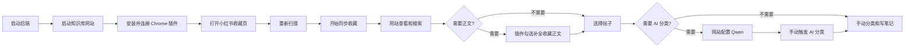

# 拾叶 · 小红书知识库

拾叶是一个运行在自己电脑上的小红书收藏整理工具：Chrome 插件负责把收藏带回来，知识库网站负责搜索、分类、标签和笔记整理。

最重要的一句话：**先同步收藏，再在网站里手动整理；同步不会自动调用 AI。**

## 第一次使用，照着做

### 你需要准备什么

- Windows、Chrome
- JDK 21 或更高版本
- Node.js 22 或更高版本
- 一个 Qwen API Key（只有想使用 AI 分类时才需要）

### 1. 下载并进入项目

```powershell
git clone https://github.com/tachikomako/XHS-knowledge-base.git xiaohongshu-knowledge-base
cd xiaohongshu-knowledge-base
```

如果你已经拿到了项目文件，就直接在 PowerShell 进入项目目录即可。

### 2. 启动后端

打开第一个 PowerShell 窗口：

```powershell
cd backend
.\mvnw.cmd spring-boot:run
```

看到 Spring Boot 启动成功后，不要关闭这个窗口。后端地址是 `http://127.0.0.1:8080`。

### 3. 启动知识库网站

打开第二个 PowerShell 窗口：

```powershell
cd frontend
npm install
npm run dev
```

打开终端显示的地址，通常是 `http://127.0.0.1:5173`。页面顶部显示“本地服务已连接”，说明网站已经连上后端。

### 4. 安装 Chrome 插件

1. 在 Chrome 地址栏打开 `chrome://extensions`。
2. 打开右上角的“开发者模式”。
3. 点击“加载已解压的扩展程序”。
4. 选择项目里的 `extension` 文件夹。
5. 点击拾叶插件的“连接设置”，填写后端地址和访问令牌。

默认开发令牌是 `dev-local-token`。正式使用前，建议通过环境变量 `XHS_EXTENSION_TOKEN` 改成随机值，并在插件里填写相同令牌。

### 5. 同步第一批收藏

1. 打开小红书个人收藏页。
2. 点击拾叶插件。
3. 点击“重新扫描”，确认看到收藏数量。
4. 直接点击“开始同步”。
5. 回到知识库网站查看刚刚导入的内容。

默认不会补全正文。只有勾选“补全收藏正文”后，插件才会逐篇打开详情页读取正文，速度会慢一些。

## 拾叶的工作流程



## AI 分类怎么用

AI 是可选功能，不影响收藏同步。

1. 在网站顶部点击“AI 设置”。
2. 填写 Qwen API Key、Base URL 和 Model。
3. 点击“保存并测试”，看到“已配置”。
4. 选择帖子后点击“分类所选帖子”，或者点击“分类全部待整理帖子”。
5. 等待任务进度完成，查看分类建议和标签结果。

AI 只在你点击分类按钮后运行。没有正文时，也会使用标题、作者、描述和原有标签；不会凭空编造正文摘要。

## 常见问题

### 页面显示“本地服务未连接”

确认后端 PowerShell 窗口还在运行，并检查访问地址是否为 `http://127.0.0.1:8080`。

### 插件扫描不到收藏

确认当前打开的是小红书收藏页，不是点赞页。刷新小红书页面后重新打开插件，再点击“重新扫描”。

### 修改代码后没有生效

- 网站：刷新浏览器页面。
- 插件：打开 `chrome://extensions`，点击拾叶的“重新加载”，再刷新小红书页面。
- 后端：回到后端窗口停止并重新运行启动命令。

### 删除知识库会取消小红书收藏吗

不会。删除只影响本地知识库数据，不会修改小红书账号里的收藏。

## 产品边界

- 插件现在只同步小红书收藏，不提供点赞同步入口。
- 插件只读取用户主动打开的小红书页面，不读取或上传 Cookie。
- 收藏列表默认导入卡片信息，完整正文按用户选择补全。
- AI 不会在同步过程中自动运行，只能在网站中手动触发。
- 数据默认保存在本地 SQLite，适合个人使用。

## 技术栈

- 扩展：Chrome Manifest V3、原生 JavaScript
- 前端：Vue 3、TypeScript、Vite、Element Plus
- 后端：Java 21、Spring Boot、MyBatis-Plus
- 数据：SQLite
- AI：Qwen（可选）

首版不使用 Redis、消息队列、向量数据库、RAG 或 Agent。

## 仓库结构

```text
backend/                 Spring Boot API
frontend/                Vue 知识库网站
extension/               Chrome Manifest V3 插件
docs/                    架构、接口和发布说明
extension/test/fixtures/ 脱敏 DOM 测试样本
```

## 开发者命令

运行全部验证：

```powershell
.\scripts\verify.ps1
```

打包 Chrome 插件：

```powershell
.\scripts\package-extension.ps1
```

接口说明见 [docs/api.md](docs/api.md)，架构边界见 [docs/architecture.md](docs/architecture.md)，发布前检查见 [docs/release-checklist.md](docs/release-checklist.md)。

## License

[MIT](LICENSE)
