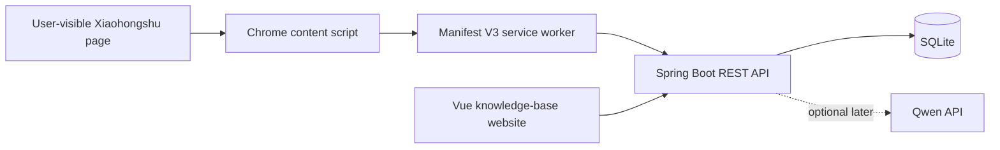

# Architecture

The MVP is a local-first modular monolith. It intentionally avoids Redis, a message broker, a vector database, RAG, and agent workflows until a measured need appears.

## Boundaries

- The extension extracts visible DOM only after a user action. It never uploads cookies, credentials, or verification data.
- The service worker owns backend requests. Content scripts only produce normalized JSON.
- The backend owns validation, URL normalization, idempotency, lifecycle rules, and persistence.
- The website is the main management UI. The extension popup stays focused on capture and connection status.
- Local lifecycle state is independent from Xiaohongshu. Trashing an item locally does not remove the platform favorite.

## Capture levels

- `CARD`: metadata visible on the favorites page. It is the reliable baseline for historical indexing.
- `DETAIL`: content visible on a currently opened post. Importing `DETAIL` upgrades an existing `CARD`; later card imports never downgrade it.

## Source abstraction

The persisted model uses `sourceType`, `sourceItemId`, and `canonicalUrl`. Only `XIAOHONGSHU` is implemented now. Future platforms should add an extractor and URL normalizer without changing item lifecycle, search, categories, or tags.

## Current milestones

- M0: backend health API, Vue shell, Manifest V3 connection popup.
- M1: SQLite storage, token-protected idempotent import, item query/update/lifecycle APIs.
- Next: current-post DOM extractor with sanitized fixture tests.
