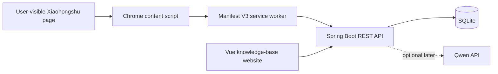

# Architecture

The MVP is a local-first modular monolith. It intentionally avoids Redis, a message broker, a vector database, RAG, and agent workflows until a measured need appears.

## Boundaries

- The extension extracts visible DOM only after a user action. It never uploads cookies, credentials, or verification data.
- The service worker owns backend requests. Content scripts only produce normalized JSON.
- The backend owns validation, URL normalization, idempotency, physical deletion, and persistence.
- The website is the main management UI. The extension popup stays focused on capture and connection status.
- Local deletion is independent from Xiaohongshu. Deleting an item locally does not remove the platform favorite; the next manual sync may recreate it.
- Manual sync runs are created only from the extension button. The run may navigate and scroll favorites/likes once, then it stops.

## Capture levels

- `CARD`: metadata visible on the favorites page. It is the reliable baseline for historical indexing.
- `DETAIL`: content visible on a currently opened post. Importing `DETAIL` upgrades an existing `CARD`; later card imports never downgrade it.

## Source abstraction

The persisted model uses `sourceType`, `sourceItemId`, and `canonicalUrl`. Only `XIAOHONGSHU` is implemented now. Future platforms should add an extractor and URL normalizer without changing item lifecycle, search, categories, or tags.

Favorites and likes are stored as item source relations, so the same Xiaohongshu `noteId` can be both favorited and liked without creating duplicate knowledge items.

## Current milestones

- M0: backend health API, Vue shell, Manifest V3 connection popup.
- M1: SQLite storage, token-protected idempotent import, item query/update/delete APIs.
- M2: user-triggered current-post preview and clipping with sanitized DOM fixture tests.
- M3: knowledge-base search, detail view, manual notes, and physical delete UI.
- M4: user-managed two-level categories, cross-category tags, item assignment, and taxonomy filters.
- M5: user-confirmed favorites-page card indexing, client deduplication, and 50-item import batches.
- M5.1: link-based card-boundary fallback, in-popup rescanning, and content-free selector diagnostics.
- M6: user-triggered sync runs, favorites/likes source adapters, bounded auto-scroll discovery, and latest sync result display.
- Next: detail-page content completion queue and retryable content status.
